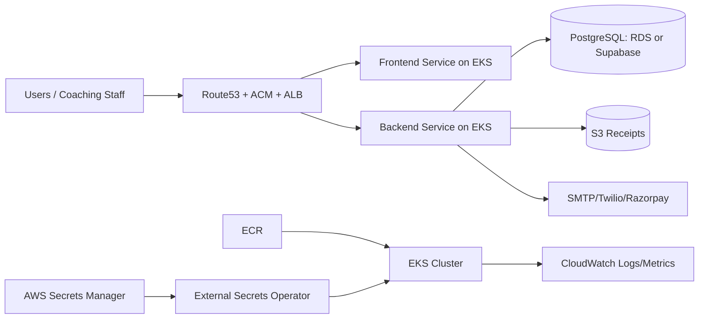

# AWS Architecture for Tuition SaaS (Production)

## Target
Run a multi-tenant SaaS on AWS with secure networking, autoscaling, observability, and simple operations.

For high-growth planning, also read:

- `docs/MILLION_SCALE_ARCHITECTURE.md`

## Recommended AWS Stack
- EKS (Kubernetes control plane)
- ECR (container image registry)
- ALB Ingress Controller (public entry)
- Route 53 + ACM (DNS + TLS)
- RDS PostgreSQL (or existing Supabase Postgres)
- Secrets Manager + External Secrets Operator
- CloudWatch Container Insights + logs
- S3 (receipts + backups + exports)
- WAF (basic bot/rate protection)

## Logical Layout
1. Public users hit ALB over HTTPS.
2. ALB routes `/api/*` to backend service and all other paths to frontend service.
3. Backend pods talk to PostgreSQL over private network/TLS.
4. Secrets are pulled from AWS Secrets Manager into K8s Secrets.
5. Logs and metrics stream to CloudWatch.

## High Availability
- Minimum 2 backend replicas across AZs.
- Minimum 2 frontend replicas across AZs.
- HPA enabled for backend based on CPU/memory.
- PodDisruptionBudget recommended for zero-downtime node updates.

## CI/CD Flow
1. Push code to GitHub.
2. Build backend and frontend images.
3. Push images to ECR.
4. Deploy with `kubectl apply -k k8s/base` or Argo CD.

## Security Checklist
- Do not commit `.env` to Git.
- Rotate JWT and webhook secrets regularly.
- Use IAM role for service account where possible.
- Restrict CORS to your domain in production.
- Enable WAF rules for login and webhook routes.

## Cost-Aware Starter Sizing
- EKS managed node group: 2 x t3.medium
- Backend: requests 250m CPU, 256Mi memory
- Frontend: requests 100m CPU, 128Mi memory
- RDS: db.t4g.micro for pilot, scale later

## Diagram

